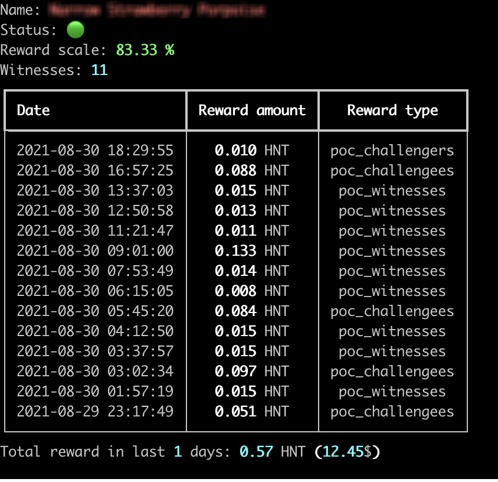

==========
easyhelium
==========

Track your recent Helium wallet activities. Easily.

Usage
===========

.. code-block:: bash

   python easyhelium.py <helium_wallet_id>

.. _pyscaffold-notes:

Note
====

This project has been set up using PyScaffold 4.0.2. For details and usage
information on PyScaffold see https://pyscaffold.org/.
